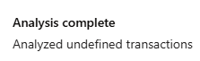
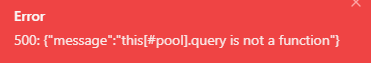
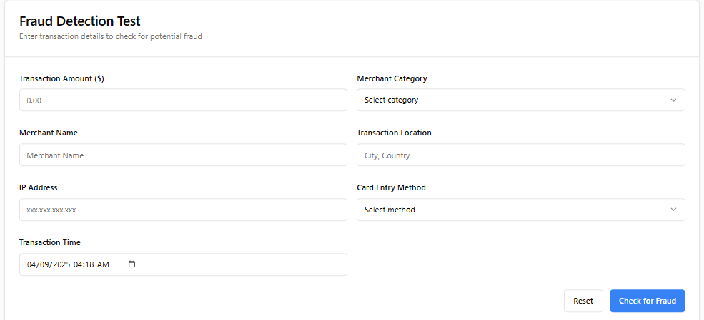

# Credit Card Fraud Detection System

A sophisticated credit card fraud detection system that leverages machine learning to provide real-time transaction risk analysis and user-friendly security insights.

## Overview

This system helps businesses and financial institutions detect potentially fraudulent credit card transactions in real-time. Using advanced machine learning algorithms, the platform analyzes transaction patterns and provides instant risk assessments with detailed visualizations and analytics.

## Features

- **Real-time Fraud Detection**: Instantly analyze transactions for potential fraud
- **Bulk CSV Analysis**: Process large transaction datasets via CSV upload
- **Interactive Dashboard**: View fraud statistics, trends, and metrics
- **Transaction History**: Review and manage all transactions
- **User Authentication**: Secure access with local and Google authentication
- **Responsive Design**: Mobile and desktop friendly interface
- **Advanced Analytics**: Detailed visualization of fraud patterns and risk factors

## Technology Stack

### Frontend
- React.js with TypeScript
- Redux for state management
- TailwindCSS for styling
- Chart.js and Recharts for visualizations
- React Query for data fetching

### Backend
- Node.js with Express
- PostgreSQL database
- Drizzle ORM for database interactions
- Passport.js for authentication

### Machine Learning
- Python Flask API
- Scikit-learn for ML models
- Pandas for data processing
- Joblib for model serialization

## Core Components

### 1. Dashboard

The dashboard provides a high-level overview of:
- Total transactions processed
- Fraud detected
- Suspicious transactions
- Detection accuracy
- Fraud trends visualization
- Fraud categories breakdown
- Recent transactions table

### 2. Fraud Detection

The fraud detection page offers:
- CSV upload for bulk transaction analysis
- Clear step-by-step instructions
- Processing feedback and results

### 3. Analytics

The analytics page provides detailed insights:
- Transaction statistics over time
- Fraud distribution by category
- High-risk merchant identification
- Detection accuracy metrics
- Customizable date range filtering

### 4. Transaction Management

The transaction management system allows:
- Viewing all transactions
- Filtering by status (fraudulent, suspicious, safe)
- Detailed transaction information
- Export capabilities

## Installation and Setup

For detailed installation instructions, please see the [INSTALLATION.md](INSTALLATION.md) file, which includes:

- Step-by-step setup process
- Required dependencies and versions
- Environment configuration
- Database setup
- Running the application

## API Documentation

For API documentation, please refer to the [API_DOCUMENTATION.md](API_DOCUMENTATION.md) file.

## Machine Learning Model

The system uses a sophisticated machine learning model trained on credit card transaction data. For details about the model, its features, and performance metrics, see the [MODEL_DOCUMENTATION.md](MODEL_DOCUMENTATION.md) file.

## Recent Updates

- Removed individual transaction test form from Dashboard
- Enhanced CSV upload for bulk transaction analysis
- Consolidated fraud metrics and visualizations in Analytics page
- Improved transaction statistics visualization
- Simplified user interface for better user experience

## Getting Started

1. Clone the repository
2. Follow the installation instructions in INSTALLATION.md
3. Start the backend and frontend servers
4. Access the application at http://localhost:3000

## License

This project is licensed under the MIT License - see the LICENSE file for details.

## Acknowledgments

- Credit card fraud detection dataset from Kaggle
- Open source community for various tools and libraries
- Contributors and testers for their valuable feedback